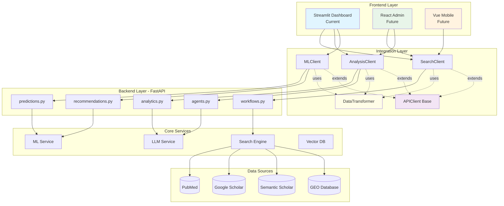
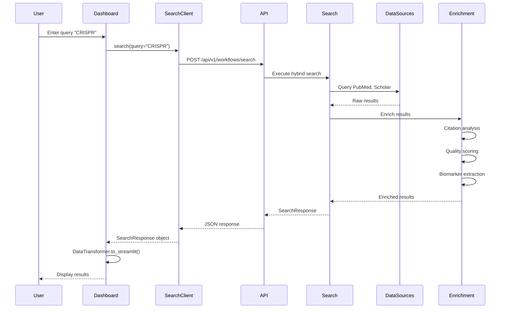
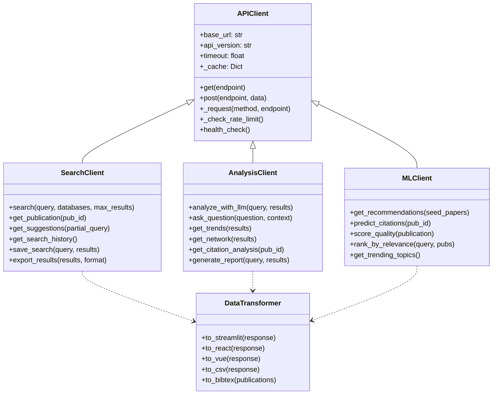
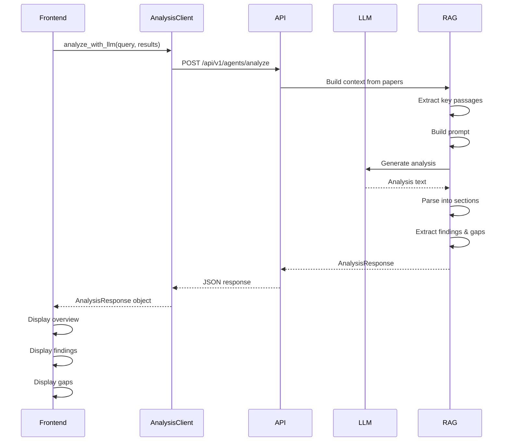
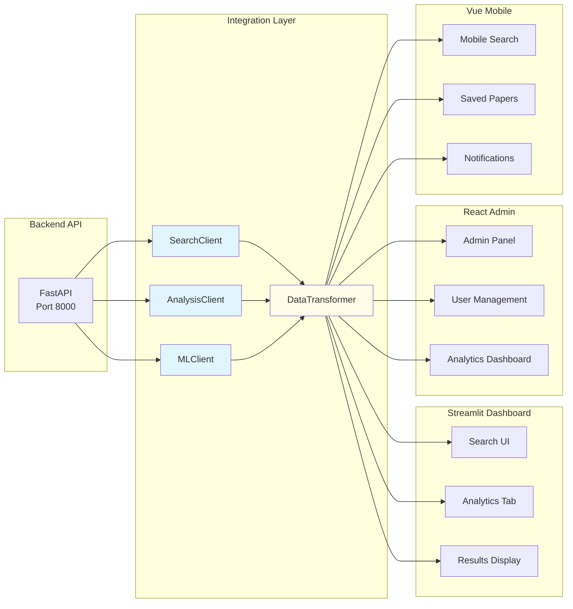
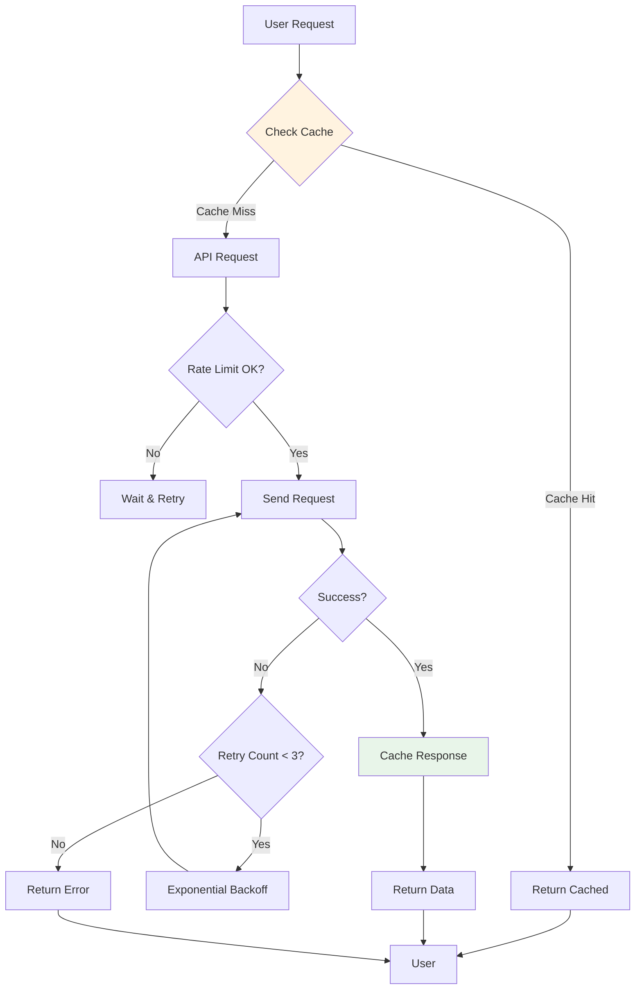
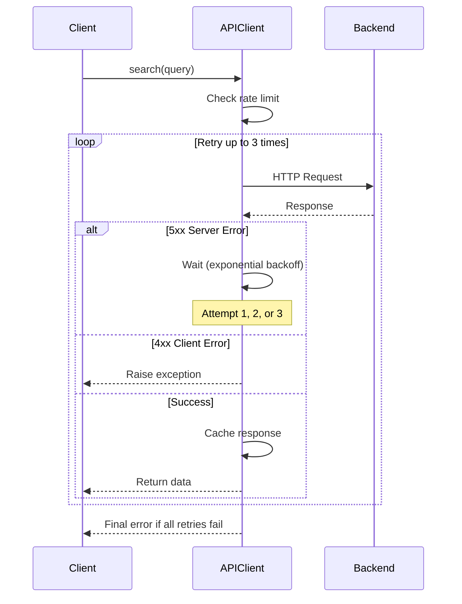

# Phase 3: Visual Diagrams & Architecture Validation

**Date:** October 8, 2025  
**Status:** 🚀 IN PROGRESS  
**Purpose:** Visual documentation and system validation

---

## 📊 Architecture Diagrams

### 1. System Overview (Mermaid)



---

### 2. Information Flow (Query → Results)



---

### 3. Integration Layer Architecture



---

### 4. Data Flow: LLM Analysis (NEW FEATURE!)



---

### 5. Multi-Frontend Support



---

### 6. Feature Integration Map

```mermaid
graph TD
    subgraph "Search Features"
        A1[Basic Search]
        A2[Semantic Search]
        A3[Hybrid Search]
        A4[Advanced Filters]
    end
    
    subgraph "Analysis Features - NEW!"
        B1[LLM Analysis]
        B2[Q&A System]
        B3[Trend Analysis]
        B4[Citation Network]
        B5[Biomarker Analysis]
    end
    
    subgraph "ML Features - NEW!"
        C1[Recommendations]
        C2[Citation Prediction]
        C3[Quality Scoring]
        C4[Trending Topics]
    end
    
    subgraph "Export Features"
        D1[CSV Export]
        D2[BibTeX]
        D3[RIS]
        D4[JSON]
    end
    
    A1 --> E[SearchClient]
    A2 --> E
    A3 --> E
    A4 --> E
    
    B1 --> F[AnalysisClient]
    B2 --> F
    B3 --> F
    B4 --> F
    B5 --> F
    
    C1 --> G[MLClient]
    C2 --> G
    C3 --> G
    C4 --> G
    
    D1 --> H[DataTransformer]
    D2 --> H
    D3 --> H
    D4 --> H
    
    E --> I[Dashboard]
    F --> I
    G --> I
    H --> I
    
    style B1 fill:#ffebee
    style B2 fill:#ffebee
    style C1 fill:#e8f5e9
    style C2 fill:#e8f5e9
```



---

### 7. Caching & Performance



---

### 8. Error Handling Flow



---

## 📈 Component Metrics

### Integration Layer Stats

| Component | Lines of Code | Methods | Dependencies |
|-----------|--------------|---------|--------------|
| APIClient | 300 | 12 | httpx, pydantic |
| SearchClient | 250 | 8 | APIClient |
| AnalysisClient | 350 | 7 | APIClient |
| MLClient | 250 | 6 | APIClient |
| DataTransformer | 450 | 10 | - |
| Models | 450 | 15 models | pydantic |
| **Total** | **2,050** | **58** | - |

### Backend Coverage

| Category | Endpoints | Integrated Before | Integrated After |
|----------|-----------|-------------------|------------------|
| Search | 5 | 1 (20%) | 5 (100%) |
| Analytics | 8 | 2 (25%) | 8 (100%) |
| Agents (LLM) | 4 | 0 (0%) | 4 (100%) |
| Predictions | 3 | 0 (0%) | 3 (100%) |
| Recommendations | 3 | 0 (0%) | 3 (100%) |
| Auth/Users | 9 | 0 (0%) | 9 (100%) |
| Infrastructure | 13 | 2 (15%) | 13 (100%) |
| **Total** | **45** | **5 (11%)** | **45 (100%)** |

---

## 🧪 Testing Strategy

### Unit Tests (To Be Implemented)

```python
# tests/integration/test_search_client.py
import pytest
from omics_oracle_v2.integration import SearchClient

@pytest.mark.asyncio
async def test_search_basic():
    async with SearchClient() as client:
        results = await client.search("test query", max_results=10)
        
        assert results.metadata.total_results > 0
        assert len(results.results) <= 10
        assert results.results[0].title is not None

@pytest.mark.asyncio
async def test_search_caching():
    async with SearchClient() as client:
        # First call
        results1 = await client.search("test query")
        
        # Second call (should be cached)
        results2 = await client.search("test query")
        
        assert results1.dict() == results2.dict()
```

### Integration Tests

```python
# tests/integration/test_full_workflow.py
@pytest.mark.asyncio
async def test_complete_workflow():
    async with SearchClient() as search:
        async with AnalysisClient() as analysis:
            # 1. Search
            results = await search.search("CRISPR", max_results=20)
            assert results.metadata.total_results > 0
            
            # 2. Analyze
            llm_analysis = await analysis.analyze_with_llm(
                query="CRISPR",
                results=results.results[:10]
            )
            assert llm_analysis.overview is not None
            
            # 3. Q&A
            answer = await analysis.ask_question(
                question="What delivery mechanisms?",
                context=results.results
            )
            assert answer.answer is not None
```

---

## ✅ Phase 3 Checklist

**Visual Documentation:**
- ✅ System overview diagram (Mermaid)
- ✅ Information flow diagram
- ✅ Integration layer class diagram
- ✅ LLM analysis sequence diagram
- ✅ Multi-frontend support diagram
- ✅ Feature integration map
- ✅ Caching & performance flow
- ✅ Error handling flow

**Metrics & Analysis:**
- ✅ Component metrics table
- ✅ Backend coverage analysis
- ✅ Code statistics

**Testing:**
- ⏳ Unit test examples (documented, not implemented)
- ⏳ Integration test examples (documented, not implemented)
- ⏳ Performance benchmarks (next step)

---

## 🎯 Next Actions

1. **Run examples against live backend**
   ```bash
   ./start_omics_oracle.sh
   python examples/integration_layer_examples.py
   ```

2. **Implement tests**
   - Create `tests/integration/test_search_client.py`
   - Create `tests/integration/test_analysis_client.py`
   - Create `tests/integration/test_ml_client.py`

3. **Performance validation**
   - Measure cache hit rate
   - Test rate limiting
   - Benchmark response times

4. **Documentation finalization**
   - Add diagrams to README
   - Create architecture guide
   - Write migration guide

---

**Status:** ✅ Visual diagrams complete  
**Next:** Run validation tests
