# OmicsOracle: Actual End-to-End Flow Analysis

**Date:** October 13, 2025
**Purpose:** Document the REAL production flow and correct layer assignments

---

## Executive Summary

**You are absolutely right!** The current layer assignments don't reflect the actual data flow. After analyzing the production code and user interactions, here's what really happens:

### The Real Flow (7 Stages)

```
User Query → Query Processing → GEO Search → Citation Discovery →
Full-text Download → Full-text Enrichment → AI Analysis → Frontend Display
```

**Current layer assignments are WRONG because:**
- ❌ GEO client is in Layer 6 (Client Adapters) but it's the PRIMARY search engine → Should be Layer 4
- ❌ Full-text download spans multiple files without clear separation
- ❌ AI analysis is mixed with other enrichment logic
- ❌ No clear distinction between "search" and "enrichment" stages

---

## Actual Production Flow (From Code Analysis)

### Stage 1: User Input (Frontend)
**File:** `api/static/dashboard_v2.html`

```javascript
// User enters query and clicks "Search"
const response = await fetch('/api/agents/search', {
    body: JSON.stringify({
        search_terms: [query],
        max_results: 20,
        enable_semantic: false
    })
});
```

**What happens:** User types query (e.g., "diabetes") → Frontend sends to `/search` endpoint

---

### Stage 2: Query Processing (NLP)
**Files:**
- `lib/nlp/biomedical_ner.py` - Extract biomedical entities
- `lib/nlp/query_expander.py` - Expand with synonyms
- `lib/query/analyzer.py` - Detect query type (GEO ID, keyword, hybrid)
- `lib/query/optimizer.py` - Optimize with NER + SapBERT

**Endpoint:** `/api/agents/search` (lines 34-120)

```python
# Build query from search terms
original_query = " ".join(request.search_terms)

# Apply GEO filters (organism, study_type)
query_parts = [original_query]
if request.filters:
    organism = request.filters.get("organism")
    if organism:
        query_parts.append(f'"{organism}"[Organism]')

query = " AND ".join(query_parts)

# Initialize orchestrator
config = OrchestratorConfig(
    enable_geo=True,
    enable_pubmed=True,
    enable_openalex=True,
)
pipeline = SearchOrchestrator(config)
```

**Output:** Optimized query with filters applied

---

### Stage 3: GEO Dataset Search (PRIMARY SEARCH)
**Files:**
- `lib/geo/client.py` - **Main search engine** (calls NCBI GEO API)
- `lib/geo/query_builder.py` - Build GEO-specific Entrez queries
- `lib/geo/models.py` - GEO metadata models

**Called by:** `SearchOrchestrator._search_geo()` (lines 322-367)

```python
async def _search_geo(self, query: str, max_results: int):
    # Step 1: Build GEO-optimized query
    geo_query = self.geo_query_builder.build_query(query, mode="balanced")
    # "diabetes" → "diabetes[All Fields] AND gse[Entry Type]"

    # Step 2: Search GEO database
    search_result = await self.geo_client.search(geo_query, max_results)
    # Returns: SearchResult(geo_ids=["GSE123456", "GSE123457", ...])

    # Step 3: Fetch metadata for each dataset
    datasets = []
    for geo_id in search_result.geo_ids:
        metadata = await self.geo_client.get_metadata(geo_id)
        datasets.append(metadata)

    return datasets
```

**Output:** List of `GEOSeriesMetadata` objects with:
- geo_id (GSE123456)
- title, summary, organism
- sample_count
- platform
- **pubmed_ids** ← Critical for next stage!

**THIS IS THE CORE SEARCH - NOT A "CLIENT ADAPTER"!**

---

### Stage 4: Citation Discovery (Publications Search)
**Files:**
- `lib/publications/clients/pubmed.py` - Search PubMed
- `lib/citations/clients/openalex.py` - Search OpenAlex
- `lib/citations/clients/scholar.py` - Search Google Scholar

**Called by:** `SearchOrchestrator._search_parallel()` (lines 252-320)

```python
async def _search_parallel(self, query: str):
    tasks = [
        self._search_geo(query),          # GEO datasets
        self._search_pubmed(query),       # PubMed publications
        self._search_openalex(query),     # OpenAlex publications
    ]

    results = await asyncio.gather(*tasks)  # Parallel execution

    geo_datasets = results[0]
    publications = results[1] + results[2]

    return geo_datasets, publications
```

**Output:**
- GEO datasets (with pubmed_ids embedded)
- Publications from PubMed/OpenAlex

**Response to frontend (lines 240-275):**

```python
# Rank datasets by relevance
ranked_datasets = []
for dataset in geo_datasets:
    score = calculate_relevance(dataset, search_terms)
    ranked_datasets.append(RankedDataset(
        dataset=dataset,
        relevance_score=score,
        match_reasons=reasons
    ))

return SearchResponse(
    datasets=ranked_datasets,      # GEO datasets with rankings
    publications=publications,      # Related publications
    total_results=len(datasets) + len(publications)
)
```

**Frontend displays datasets with "Download Papers" button**

---

### Stage 5: Full-text URL Discovery (MANUAL TRIGGER)
**Files:**
- `lib/fulltext/manager.py` - **URL discovery orchestrator**
- `lib/fulltext/sources/scihub_client.py` - Sci-Hub URLs
- `lib/fulltext/sources/libgen_client.py` - Library Genesis URLs
- `lib/fulltext/sources/unpaywall_client.py` - Unpaywall URLs
- `lib/publications/clients/institutional_access.py` - Institutional access
- `lib/publications/clients/oa_sources.py` - Open access sources (PMC, DOAJ, etc.)

**Triggered by:** User clicks "Download Papers" button

**Endpoint:** `/api/agents/enrich-fulltext` (lines 283-656)

```python
@router.post("/enrich-fulltext")
async def enrich_fulltext(datasets: List[DatasetResponse]):
    # For each dataset's pubmed_ids
    for dataset in datasets:
        publications = []

        # Fetch full publication metadata
        for pmid in dataset.pubmed_ids:
            pub = pubmed_client.fetch_by_id(pmid)
            publications.append(pub)

        # STEP 1: Get URLs from ALL sources (waterfall)
        fulltext_results = await fulltext_manager.get_fulltext_batch(publications)

        # STEP 2: Set fulltext_url on publications
        for pub, result in zip(publications, fulltext_results):
            if result.success:
                pub.fulltext_url = result.url
                pub.fulltext_source = result.source.value
```

**Waterfall URL discovery (11 sources in order):**
1. PMC (PubMed Central) - Free, official
2. DOAJ (Directory of Open Access) - Free
3. Europe PMC - Free, European mirror
4. Unpaywall - Aggregator of legal free PDFs
5. BASE (Bielefeld Academic Search) - Repository search
6. CORE - Academic repository aggregator
7. Institutional Access - University/library subscriptions
8. OpenAlex - Has PDF links
9. Sci-Hub - **Pirate source** (last resort)
10. Library Genesis - **Pirate source** (last resort)
11. Semantic Scholar - Academic search

**Output:** Publications with `fulltext_url` and `fulltext_source` set

---

### Stage 6: PDF Download & Parsing (CONTINUES FROM STAGE 5)
**Files:**
- `lib/fulltext/pdf_downloader.py` - Download PDFs from URLs
- `lib/fulltext/pdf_parser.py` - Extract text from PDFs

**Endpoint:** Same `/api/agents/enrich-fulltext` (lines 450-550)

```python
        # STEP 3: Download PDFs with waterfall retry
        publications_with_urls = [p for p in publications if p.fulltext_url]

        pdf_dir = Path("data/fulltext/pdfs")
        download_report = await pdf_downloader.download_batch(
            publications=publications_with_urls,
            output_dir=pdf_dir,
            url_field="fulltext_url"
        )

        # STEP 3B: WATERFALL RETRY for failed downloads
        for pub in failed_downloads:
            # Keep trying ALL remaining sources until success
            for source in remaining_sources:
                retry_result = await fulltext_manager.get_fulltext(pub, skip_sources=tried)
                if retry_result.success:
                    # Try download again
                    download_again = await pdf_downloader.download_single(pub, retry_result.url)
                    if download_again.success:
                        break

        # STEP 4: Parse PDFs to extract sections
        for pub in publications_with_pdfs:
            parsed_content = await pdf_parser.parse_pdf(pub.pdf_path)

            fulltext_info = {
                "pmid": pub.pmid,
                "title": pub.title,
                "abstract": parsed_content.get("abstract"),
                "methods": parsed_content.get("methods"),
                "results": parsed_content.get("results"),
                "discussion": parsed_content.get("discussion"),
                "pdf_path": str(pub.pdf_path)
            }

            dataset.fulltext.append(fulltext_info)

        dataset.fulltext_count = len(dataset.fulltext)
        dataset.fulltext_status = "available" if fulltext_count > 0 else "failed"
```

**Output:** Dataset with enriched `fulltext` array containing parsed PDF sections

**Frontend displays:** "✅ Downloaded 3/5 papers" with "Analyze with AI" button enabled

---

### Stage 7: AI Analysis (MANUAL TRIGGER)
**Files:**
- `lib/ai/client.py` - LLM API client (OpenAI/Anthropic)
- `lib/ai/prompts.py` - Prompt templates
- `lib/ai/models.py` - AI request/response models

**Triggered by:** User clicks "Analyze with AI" button

**Endpoint:** `/api/agents/analyze` (lines 700-790)

```python
@router.post("/analyze")
async def analyze_datasets(request: AIAnalysisRequest):
    # Initialize AI client
    ai_client = SummarizationClient()

    # Build context from datasets with fulltext
    context = []
    for dataset in request.datasets[:request.max_datasets]:
        dataset_context = f"""
        Dataset: {dataset.geo_id}
        Title: {dataset.title}
        Organism: {dataset.organism}
        Samples: {dataset.sample_count}

        Publications:
        """

        # Add fulltext content
        for ft in dataset.fulltext:
            dataset_context += f"""
            PMID {ft['pmid']}: {ft['title']}
            Abstract: {ft['abstract']}
            Methods: {ft['methods']}
            Results: {ft['results']}
            """

        context.append(dataset_context)

    # Generate AI analysis
    analysis_result = await ai_client.analyze(
        query=request.query,
        datasets_context="\n\n".join(context)
    )

    return AIAnalysisResponse(
        success=True,
        analysis=analysis_result.summary,
        insights=analysis_result.key_findings,
        recommendations=analysis_result.recommendations,
        model_used=analysis_result.model
    )
```

**Output:** AI-generated analysis with insights and recommendations

**Frontend displays:** Analysis text with insights, recommendations, and datasets analyzed

---

## The Real Layer Structure (Should Be)

Based on the ACTUAL flow, here's how layers should be organized:

### ✅ Proposed Correct Layers

```
┌─────────────────────────────────────────────────────────┐
│ Layer 1: Frontend (Dashboard)                           │
│  - dashboard_v2.html                                    │
└────────────────────────┬────────────────────────────────┘
                         │
                         ↓
┌─────────────────────────────────────────────────────────┐
│ Layer 2: API Gateway                                     │
│  - api/routes/agents.py                                 │
│  - /search, /enrich-fulltext, /analyze                  │
└────────────────────────┬────────────────────────────────┘
                         │
                         ↓
┌─────────────────────────────────────────────────────────┐
│ Layer 3: Query Processing (NLP)                         │
│  - lib/nlp/biomedical_ner.py                           │
│  - lib/nlp/query_expander.py                           │
│  - lib/query/analyzer.py                                │
│  - lib/query/optimizer.py                               │
└────────────────────────┬────────────────────────────────┘
                         │
                         ↓
┌─────────────────────────────────────────────────────────┐
│ Layer 4: Search Orchestration                           │
│  - lib/search/orchestrator.py (coordination only)       │
└───────────┬──────────────────────────────┬──────────────┘
            │                              │
            ↓                              ↓
┌───────────────────────┐    ┌──────────────────────────┐
│ Layer 5a: GEO Search  │    │ Layer 5b: Citation Search│
│  - lib/geo/           │    │  - lib/publications/     │
│    • client.py        │    │    • clients/pubmed.py   │
│    • query_builder.py │    │  - lib/citations/        │
│    • models.py        │    │    • clients/openalex.py │
└───────────────────────┘    └──────────────────────────┘
            │                              │
            └──────────────┬───────────────┘
                           ↓
┌─────────────────────────────────────────────────────────┐
│ Layer 6: Full-text Enrichment                           │
│  - lib/fulltext/manager.py (URL discovery orchestrator) │
│  - lib/fulltext/pdf_downloader.py (PDF download)        │
│  - lib/fulltext/pdf_parser.py (text extraction)         │
│  - lib/fulltext/sources/ (11 URL sources)               │
│    • scihub_client.py, libgen_client.py, etc.          │
│  - lib/publications/clients/oa_sources.py               │
└────────────────────────┬────────────────────────────────┘
                         │
                         ↓
┌─────────────────────────────────────────────────────────┐
│ Layer 7: AI Analysis                                     │
│  - lib/ai/client.py (LLM client)                        │
│  - lib/ai/prompts.py (prompt engineering)               │
│  - lib/ai/models.py (request/response models)           │
└────────────────────────┬────────────────────────────────┘
                         │
                         ↓
┌─────────────────────────────────────────────────────────┐
│ Layer 8: Infrastructure (Cross-cutting)                 │
│  - lib/cache/redis_cache.py                             │
│  - lib/embeddings/service.py                            │
│  - lib/vector_db/faiss_db.py                            │
│  - lib/storage/ (database, file storage)                │
└─────────────────────────────────────────────────────────┘
```

---

## Flow Diagram (Mermaid)

```mermaid
graph TB
    Start([User enters query]) --> Frontend[Layer 1: Frontend Dashboard]
    Frontend -->|POST /search| API[Layer 2: API Gateway]

    API --> QueryProc[Layer 3: Query Processing<br/>NER + Optimization]

    QueryProc --> Orch[Layer 4: Search Orchestrator<br/>Coordinates parallel search]

    Orch -->|Parallel| GEO[Layer 5a: GEO Search<br/>NCBI GEO API]
    Orch -->|Parallel| Pub[Layer 5b: Citation Search<br/>PubMed + OpenAlex]

    GEO --> Cache1{Cache?}
    Cache1 -->|Hit| Results1[Return cached results]
    Cache1 -->|Miss| NCBI[NCBI GEO Database]
    NCBI --> GEOData[GEO Datasets<br/>with pubmed_ids]

    Pub --> PubMedAPI[PubMed API]
    Pub --> OpenAlexAPI[OpenAlex API]
    PubMedAPI --> PubData[Publications]
    OpenAlexAPI --> PubData

    GEOData --> Combine[Combine & Rank]
    PubData --> Combine

    Combine --> Display1[Display: Datasets + Publications]

    Display1 --> UserClick1{User clicks<br/>Download Papers?}
    UserClick1 -->|No| End1([End])
    UserClick1 -->|Yes| Enrich[Layer 6: Full-text Enrichment]

    Enrich --> URLDisc[URL Discovery<br/>Waterfall through 11 sources]
    URLDisc --> PMC[1. PMC Free]
    PMC --> DOAJ[2. DOAJ]
    DOAJ --> EuroPMC[3. Europe PMC]
    EuroPMC --> Unpaywall[4. Unpaywall]
    Unpaywall --> BASE[5. BASE]
    BASE --> CORE[6. CORE]
    CORE --> Institutional[7. Institutional]
    Institutional --> OA[8. OpenAlex]
    OA --> SciHub[9. Sci-Hub]
    SciHub --> LibGen[10. LibGen]
    LibGen --> SemanticScholar[11. Semantic Scholar]

    SemanticScholar --> URLs[Publications with URLs]

    URLs --> Download[PDF Download<br/>with retry logic]
    Download --> Parse[PDF Parsing<br/>Extract sections]
    Parse --> Sections[Abstract, Methods,<br/>Results, Discussion]

    Sections --> Display2[Display: Papers downloaded]

    Display2 --> UserClick2{User clicks<br/>Analyze with AI?}
    UserClick2 -->|No| End2([End])
    UserClick2 -->|Yes| AI[Layer 7: AI Analysis]

    AI --> BuildContext[Build context from<br/>fulltext sections]
    BuildContext --> LLM[LLM API<br/>OpenAI/Anthropic]
    LLM --> Analysis[AI Analysis:<br/>Insights + Recommendations]

    Analysis --> Display3[Display: AI Analysis]
    Display3 --> End3([End])

    style Frontend fill:#e1f5fe
    style API fill:#b3e5fc
    style QueryProc fill:#81d4fa
    style Orch fill:#4fc3f7
    style GEO fill:#29b6f6
    style Pub fill:#29b6f6
    style Enrich fill:#ffd54f
    style AI fill:#ff8a65
    style Display1 fill:#a5d6a7
    style Display2 fill:#a5d6a7
    style Display3 fill:#a5d6a7
```



---

## Critical Issues with Current Layer Assignment

### ❌ Issue 1: GEO Client is in Layer 6 (Wrong!)

**Current:** `lib/geo/client.py` is classified as "Client Adapter" (Layer 6)

**Reality:** GEO search is the PRIMARY search function, not a "client adapter"

**Why it matters:**
- GEO search is Stage 3 (core search), not Stage 6 (enrichment)
- It returns the main dataset results
- Everything else builds on GEO results (pubmed_ids → fulltext → AI)

**Should be:** Layer 5a (GEO Search Engine)

---

### ❌ Issue 2: Publications Clients are Mixed

**Current:** PubMed and OpenAlex are in Layer 6 as "client adapters"

**Reality:** They serve TWO different purposes:
1. **Citation discovery** (Stage 4) - Search for related publications
2. **Metadata enrichment** (Stage 5) - Fetch full details for pubmed_ids

**Should be:**
- Layer 5b (Citation Search) - When searching for publications
- Layer 6 (Full-text Enrichment) - When fetching metadata for download

---

### ❌ Issue 3: Full-text is Scattered

**Current:** Full-text logic spread across multiple layers

**Files involved:**
- `lib/fulltext/manager.py` - Orchestrates URL discovery
- `lib/fulltext/sources/*.py` - 11 different URL sources
- `lib/fulltext/pdf_downloader.py` - Downloads PDFs
- `lib/fulltext/pdf_parser.py` - Parses PDFs
- `lib/publications/clients/oa_sources.py` - Open access URLs
- `lib/publications/clients/institutional_access.py` - Institutional URLs

**Reality:** These are ALL part of Stage 5-6 (Full-text Enrichment)

**Should be:** All in Layer 6 (Full-text Enrichment)

---

### ❌ Issue 4: AI Analysis Needs Its Own Layer

**Current:** AI is lumped with "enrichment" in some docs

**Reality:** AI analysis is:
- Stage 7 (final stage)
- User-triggered (not automatic)
- Consumes fulltext from Stage 6
- Completely separate concern

**Should be:** Layer 7 (AI Analysis)

---

## Recommended Refactoring

### Phase 1: Reorganize by Flow Stage

```bash
# Move GEO from "clients" to "search engines"
lib/search_engines/geo/
  ├── client.py          # GEO API client
  ├── query_builder.py   # GEO query optimization
  └── models.py          # GEO data models

# Keep citation search separate
lib/search_engines/citations/
  ├── pubmed.py          # PubMed search
  ├── openalex.py        # OpenAlex search
  └── scholar.py         # Google Scholar search

# Consolidate all full-text enrichment
lib/enrichment/fulltext/
  ├── manager.py         # URL discovery orchestrator
  ├── downloader.py      # PDF download
  ├── parser.py          # PDF parsing
  └── sources/           # All 11 URL sources
      ├── free/          # PMC, DOAJ, Unpaywall
      ├── repositories/  # BASE, CORE, institutional
      └── fallback/      # Sci-Hub, LibGen (pirates)

# AI analysis separate
lib/analysis/ai/
  ├── client.py          # LLM client
  ├── prompts.py         # Prompt engineering
  └── models.py          # Request/response models
```

### Phase 2: Clarify SearchOrchestrator Role

**Current:** SearchOrchestrator does EVERYTHING (search + coordination)

**Should be:**
- `lib/search/orchestrator.py` - ONLY coordinate parallel searches
- Move actual search logic to search engines (Layer 5a/5b)

```python
# Orchestrator should be thin
class SearchOrchestrator:
    async def search(self, query: str):
        # Step 1: Analyze query (Layer 3)
        analysis = self.query_analyzer.analyze(query)

        # Step 2: Parallel search (Layer 5a + 5b)
        geo_results, pub_results = await asyncio.gather(
            self.geo_search_engine.search(query),
            self.citation_search_engine.search(query)
        )

        # Step 3: Combine and return
        return SearchResult(
            datasets=geo_results,
            publications=pub_results
        )
```

---

## Summary: Correct Layer Assignments

| Layer | Name | Files | Stage | Flow Position |
|-------|------|-------|-------|---------------|
| **1** | Frontend | `api/static/dashboard_v2.html` | User Input | Start |
| **2** | API Gateway | `api/routes/agents.py` | Request Routing | Entry point |
| **3** | Query Processing | `lib/nlp/`, `lib/query/` | NLP Analysis | Query optimization |
| **4** | Search Orchestration | `lib/search/orchestrator.py` | Coordination | Parallel execution |
| **5a** | GEO Search Engine | `lib/geo/` | Dataset Search | PRIMARY search |
| **5b** | Citation Search | `lib/publications/`, `lib/citations/` | Publication Search | Related papers |
| **6** | Full-text Enrichment | `lib/fulltext/` | PDF Download & Parse | Content extraction |
| **7** | AI Analysis | `lib/ai/` | LLM Analysis | Final insights |
| **8** | Infrastructure | `lib/cache/`, `lib/embeddings/` | Cross-cutting | Support |

---

## Next Steps

1. **Accept this flow as the truth** ✅
2. **Re-evaluate "redundant code"** based on ACTUAL stages, not theoretical layers
3. **Consider refactoring** to match flow (move GEO to search engines, consolidate fulltext)
4. **Update documentation** to reflect real architecture

**Key Insight:** The code organization should mirror the USER FLOW, not abstract layer theory. Each stage (query → search → enrich → analyze) should have its own clear location.

Would you like me to proceed with redundancy analysis based on this CORRECT flow understanding?
