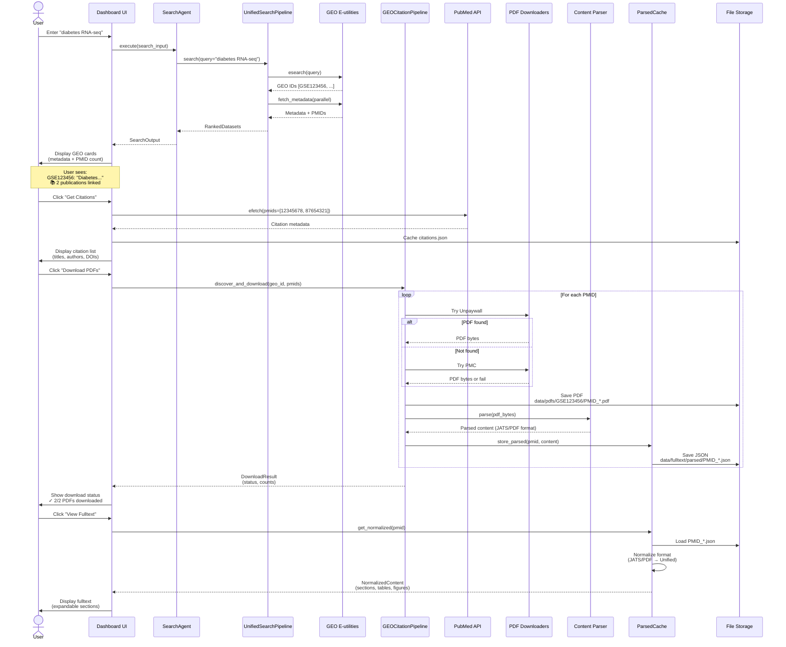
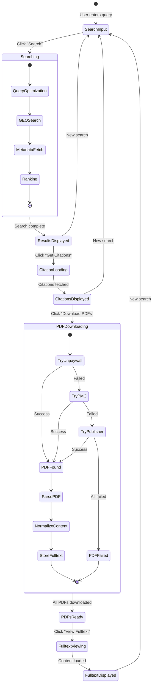
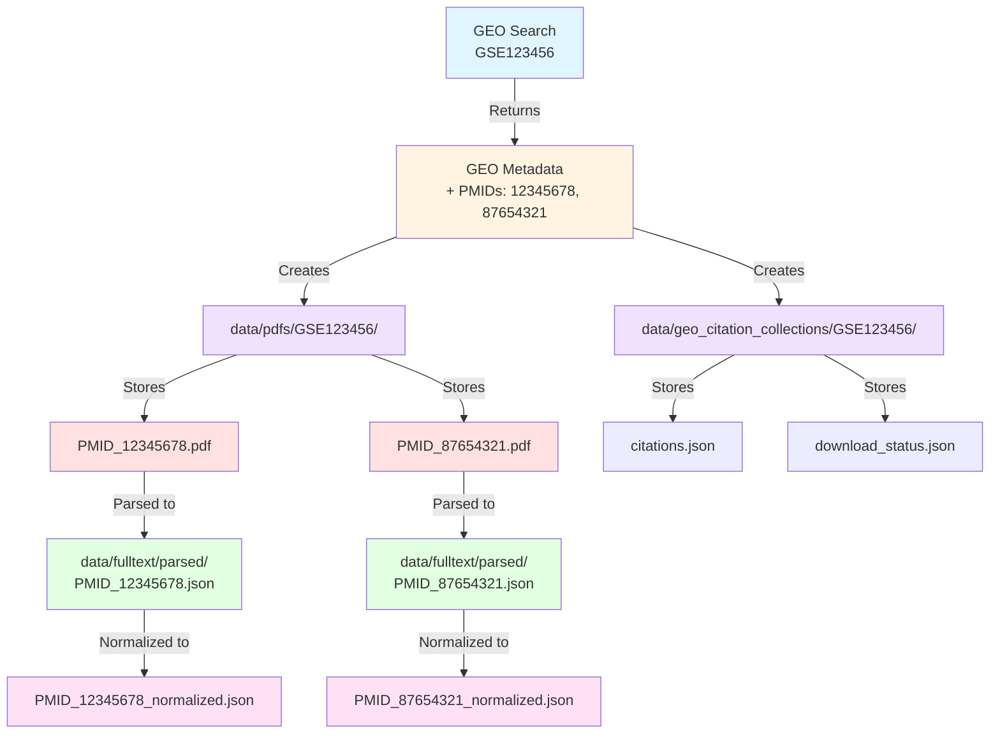
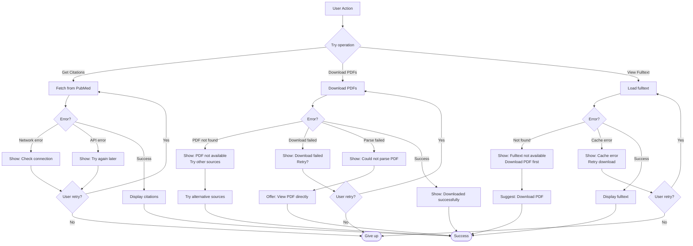

# Visual Integration Flowcharts
**Date:** October 12, 2025  
**Purpose:** Mermaid diagrams for end-to-end integration flow

## 1. Complete User Journey (Sequence Diagram)



## 2. Data Flow Architecture

```mermaid
graph TB
    subgraph Frontend["🖥️ FRONTEND (Streamlit Dashboard)"]
        SearchBox[Search Input Box]
        GEOCard[GEO Dataset Card]
        CitationList[Citation List]
        PDFViewer[PDF Viewer]
        FulltextViewer[Fulltext Viewer]
    end
    
    subgraph Agents["🤖 AGENTS LAYER"]
        QueryAgent[QueryAgent<br/>NER + Intent]
        SearchAgent[SearchAgent<br/>GEO Search]
    end
    
    subgraph Pipelines["⚙️ PIPELINES LAYER"]
        UnifiedPipeline[UnifiedSearchPipeline<br/>GEO + Publications]
        CitationPipeline[GEOCitationPipeline<br/>Discover + Download]
    end
    
    subgraph Services["🌐 EXTERNAL SERVICES"]
        NCBI[NCBI E-utilities<br/>GEO Database]
        PubMed[PubMed API<br/>Citation Metadata]
        Unpaywall[Unpaywall API<br/>Open Access PDFs]
        PMC[PMC API<br/>PubMed Central]
    end
    
    subgraph Storage["💾 LOCAL STORAGE"]
        PDFStorage[(PDFs<br/>data/pdfs/GSE*/)]
        FulltextStorage[(Fulltext<br/>data/fulltext/parsed/)]
        CacheStorage[(Cache<br/>data/cache/)]
        CollectionStorage[(Collections<br/>data/geo_citation_collections/)]
    end
    
    subgraph Processing["🔧 PROCESSING"]
        Parser[Content Parser<br/>JATS/PDF/LaTeX]
        Normalizer[Content Normalizer<br/>Phase 5]
        ParsedCache[ParsedCache<br/>Smart Caching]
    end
    
    %% User interactions
    SearchBox -->|1. Query| QueryAgent
    QueryAgent -->|2. Optimized Query| SearchAgent
    SearchAgent -->|3. Search| UnifiedPipeline
    
    %% Search flow
    UnifiedPipeline -->|4. Query| NCBI
    NCBI -->|5. GEO Metadata + PMIDs| UnifiedPipeline
    UnifiedPipeline -->|6. Results| GEOCard
    
    %% Citation discovery
    GEOCard -->|7. User clicks<br/>"Get Citations"| PubMed
    PubMed -->|8. Citation Metadata| CitationList
    CitationList -->|9. Cache| CollectionStorage
    
    %% PDF download
    CitationList -->|10. User clicks<br/>"Download PDFs"| CitationPipeline
    CitationPipeline -->|11. Request PDFs| Unpaywall
    CitationPipeline -->|12. Fallback| PMC
    Unpaywall -->|13. PDF bytes| CitationPipeline
    PMC -->|13. PDF bytes| CitationPipeline
    
    %% Parsing and storage
    CitationPipeline -->|14. Parse| Parser
    Parser -->|15. Parsed content| Normalizer
    Normalizer -->|16. Normalized| ParsedCache
    ParsedCache -->|17. Store| PDFStorage
    ParsedCache -->|18. Store| FulltextStorage
    
    %% Fulltext viewing
    FulltextViewer -->|19. User clicks<br/>"View Fulltext"| ParsedCache
    ParsedCache -->|20. Load| FulltextStorage
    ParsedCache -->|21. Return| FulltextViewer
    
    %% Caching
    UnifiedPipeline -.->|Cache hits| CacheStorage
    ParsedCache -.->|Cache normalized| CacheStorage
    
    style Frontend fill:#e1f5ff
    style Agents fill:#fff4e1
    style Pipelines fill:#f0e1ff
    style Services fill:#e1ffe1
    style Storage fill:#ffe1e1
    style Processing fill:#ffe1f5
```

## 3. State Transition Diagram



## 4. Component Interaction Diagram

```mermaid
graph LR
    subgraph UI["Dashboard UI Components"]
        SearchPanel[SearchPanel]
        ResultsPanel[ResultsPanel]
        GEOCard[GEODatasetCard]
        CitationCard[CitationCard]
        FulltextPanel[FulltextPanel]
    end
    
    subgraph State["Session State"]
        SearchState[search_results:<br/>List[GEODataset]]
        DatasetState[dataset_state:<br/>Dict[geo_id, State]]
        FileMap[file_map:<br/>Dict[geo_id, Paths]]
    end
    
    subgraph Backend["Backend Services"]
        SearchSvc[SearchAgent]
        CiteSvc[Citation Service]
        PDFSvc[PDF Download Service]
        CacheSvc[ParsedCache]
    end
    
    SearchPanel -->|search query| SearchSvc
    SearchSvc -->|results| SearchState
    SearchState -->|render| ResultsPanel
    ResultsPanel -->|for each| GEOCard
    
    GEOCard -->|get citations| CiteSvc
    CiteSvc -->|update| DatasetState
    DatasetState -->|render| CitationCard
    
    CitationCard -->|download PDFs| PDFSvc
    PDFSvc -->|update| FileMap
    FileMap -->|load| CacheSvc
    CacheSvc -->|display| FulltextPanel
```

## 5. File Organization Flow



## 6. Button Click Flow

```mermaid
flowchart TD
    Start([User sees GEO result])
    
    Start --> ShowBasic[Display Basic Info:<br/>- GEO ID<br/>- Title<br/>- Organism<br/>- Sample count<br/>- PMID count]
    
    ShowBasic --> HasPMIDs{Has PMIDs?}
    
    HasPMIDs -->|Yes| ShowGetCite[Show button:<br/>'Get Citations']
    HasPMIDs -->|No| End1([No citations available])
    
    ShowGetCite --> ClickCite{User clicks?}
    ClickCite -->|No| Wait1[Wait...]
    Wait1 --> ClickCite
    
    ClickCite -->|Yes| CheckCache{Citations<br/>cached?}
    
    CheckCache -->|Yes| LoadCache[Load from:<br/>data/geo_citation_collections/<br/>GSE*/citations.json]
    CheckCache -->|No| FetchPubMed[Fetch from PubMed API]
    
    FetchPubMed --> SaveCache[Save to cache]
    SaveCache --> DisplayCite
    LoadCache --> DisplayCite[Display citations:<br/>- Title<br/>- Authors<br/>- Journal<br/>- DOI]
    
    DisplayCite --> ShowDownload[Show button:<br/>'Download PDFs']
    
    ShowDownload --> ClickDownload{User clicks?}
    ClickDownload -->|No| Wait2[Wait...]
    Wait2 --> ClickDownload
    
    ClickDownload -->|Yes| StartDownload[Start GEOCitationPipeline]
    
    StartDownload --> ForEachPMID[For each PMID]
    
    ForEachPMID --> TryUnpaywall{Try Unpaywall}
    TryUnpaywall -->|Found| DownloadPDF[Download PDF]
    TryUnpaywall -->|Not found| TryPMC{Try PMC}
    TryPMC -->|Found| DownloadPDF
    TryPMC -->|Not found| Failed[Mark as failed]
    
    DownloadPDF --> ParsePDF[Parse PDF to text]
    ParsePDF --> Normalize[Normalize content]
    Normalize --> SaveFiles[Save:<br/>- data/pdfs/GSE*/<br/>- data/fulltext/parsed/]
    
    SaveFiles --> NextPMID{More PMIDs?}
    NextPMID -->|Yes| ForEachPMID
    NextPMID -->|No| ShowStatus[Show download status:<br/>✓ X/Y PDFs downloaded]
    
    Failed --> NextPMID
    
    ShowStatus --> ShowFulltext[Show button:<br/>'View Fulltext']
    
    ShowFulltext --> ClickFulltext{User clicks?}
    ClickFulltext -->|No| Wait3[Wait...]
    Wait3 --> ClickFulltext
    
    ClickFulltext -->|Yes| LoadFulltext[Load normalized content<br/>from ParsedCache]
    
    LoadFulltext --> DisplaySections[Display sections:<br/>- Abstract<br/>- Introduction<br/>- Methods<br/>- Results<br/>- Discussion]
    
    DisplaySections --> DisplayTables[Display tables<br/>as dataframes]
    
    DisplayTables --> DisplayFigures[Display figure<br/>captions]
    
    DisplayFigures --> End2([User can read fulltext])
    
    style ShowBasic fill:#e1f5ff
    style DisplayCite fill:#fff4e1
    style ShowStatus fill:#f0e1ff
    style DisplaySections fill:#e1ffe1
    style End2 fill:#ffe1f5
```



## 7. Error Handling Flow



---

## 8. How to Use These Diagrams

### In Documentation
Copy the Mermaid code blocks into:
- GitHub README (renders automatically)
- VS Code (with Mermaid extension)
- Online Mermaid Live Editor (https://mermaid.live)

### In Presentations
- Export as PNG/SVG from Mermaid Live
- Include in slides or technical docs

### For Development
- Use as reference while implementing
- Share with team for alignment
- Update as implementation evolves

---

## Quick Reference

### Key Files to Modify
1. `omics_oracle_v2/lib/dashboard/app.py` - Main dashboard logic
2. `omics_oracle_v2/lib/dashboard/components.py` - UI components
3. `omics_oracle_v2/lib/pipelines/geo_citation_pipeline.py` - PDF download (already exists)
4. `omics_oracle_v2/lib/fulltext/cache.py` - Fulltext caching (already exists)

### Key Data Structures
1. **GEODatasetResult** - Search result with metadata + PMIDs
2. **Citation** - Citation metadata (title, authors, DOI)
3. **DownloadResult** - PDF download status + counts
4. **NormalizedContent** - Parsed fulltext in unified format

### Key Integration Points
1. **SearchAgent → Dashboard** - Pass GEO results with PMIDs
2. **Dashboard → GEOCitationPipeline** - Download PDFs on demand
3. **Dashboard → ParsedCache** - Retrieve normalized fulltext
4. **Session State** - Track per-dataset state (citations loaded, PDFs downloaded)
