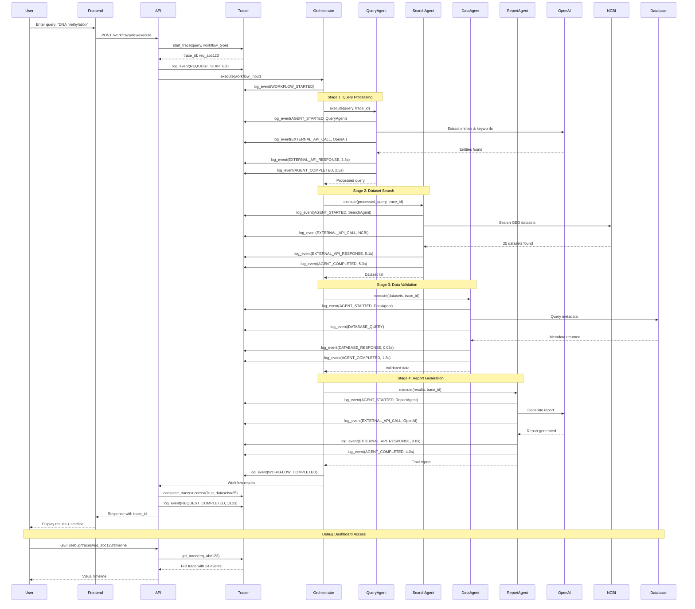

```mermaid
sequenceDiagram
    participant User
    participant Frontend
    participant API
    participant Tracer
    participant Orchestrator
    participant QueryAgent
    participant SearchAgent
    participant DataAgent
    participant ReportAgent
    participant OpenAI
    participant NCBI
    participant Database

    User->>Frontend: Enter query: "DNA methylation"
    Frontend->>API: POST /workflows/dev/execute
    API->>Tracer: start_trace(query, workflow_type)
    Tracer-->>API: trace_id: req_abc123
    
    API->>Tracer: log_event(REQUEST_STARTED)
    API->>Orchestrator: execute(workflow_input)
    Orchestrator->>Tracer: log_event(WORKFLOW_STARTED)
    
    Note over Orchestrator,QueryAgent: Stage 1: Query Processing
    Orchestrator->>QueryAgent: execute(query, trace_id)
    QueryAgent->>Tracer: log_event(AGENT_STARTED, QueryAgent)
    QueryAgent->>OpenAI: Extract entities & keywords
    QueryAgent->>Tracer: log_event(EXTERNAL_API_CALL, OpenAI)
    OpenAI-->>QueryAgent: Entities found
    QueryAgent->>Tracer: log_event(EXTERNAL_API_RESPONSE, 2.3s)
    QueryAgent->>Tracer: log_event(AGENT_COMPLETED, 2.5s)
    QueryAgent-->>Orchestrator: Processed query
    
    Note over Orchestrator,SearchAgent: Stage 2: Dataset Search
    Orchestrator->>SearchAgent: execute(processed_query, trace_id)
    SearchAgent->>Tracer: log_event(AGENT_STARTED, SearchAgent)
    SearchAgent->>NCBI: Search GEO datasets
    SearchAgent->>Tracer: log_event(EXTERNAL_API_CALL, NCBI)
    NCBI-->>SearchAgent: 25 datasets found
    SearchAgent->>Tracer: log_event(EXTERNAL_API_RESPONSE, 5.1s)
    SearchAgent->>Tracer: log_event(AGENT_COMPLETED, 5.3s)
    SearchAgent-->>Orchestrator: Dataset list
    
    Note over Orchestrator,DataAgent: Stage 3: Data Validation
    Orchestrator->>DataAgent: execute(datasets, trace_id)
    DataAgent->>Tracer: log_event(AGENT_STARTED, DataAgent)
    DataAgent->>Database: Query metadata
    DataAgent->>Tracer: log_event(DATABASE_QUERY)
    Database-->>DataAgent: Metadata returned
    DataAgent->>Tracer: log_event(DATABASE_RESPONSE, 0.02s)
    DataAgent->>Tracer: log_event(AGENT_COMPLETED, 1.2s)
    DataAgent-->>Orchestrator: Validated data
    
    Note over Orchestrator,ReportAgent: Stage 4: Report Generation
    Orchestrator->>ReportAgent: execute(results, trace_id)
    ReportAgent->>Tracer: log_event(AGENT_STARTED, ReportAgent)
    ReportAgent->>OpenAI: Generate report
    ReportAgent->>Tracer: log_event(EXTERNAL_API_CALL, OpenAI)
    OpenAI-->>ReportAgent: Report generated
    ReportAgent->>Tracer: log_event(EXTERNAL_API_RESPONSE, 3.8s)
    ReportAgent->>Tracer: log_event(AGENT_COMPLETED, 4.0s)
    ReportAgent-->>Orchestrator: Final report
    
    Orchestrator->>Tracer: log_event(WORKFLOW_COMPLETED)
    Orchestrator-->>API: Workflow results
    API->>Tracer: complete_trace(success=True, datasets=25)
    API->>Tracer: log_event(REQUEST_COMPLETED, 13.2s)
    
    API-->>Frontend: Response with trace_id
    Frontend-->>User: Display results + timeline
    
    Note over User,Database: Debug Dashboard Access
    User->>API: GET /debug/traces/req_abc123/timeline
    API->>Tracer: get_trace(req_abc123)
    Tracer-->>API: Full trace with 24 events
    API-->>User: Visual timeline
```
