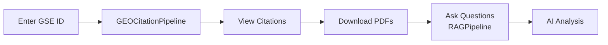
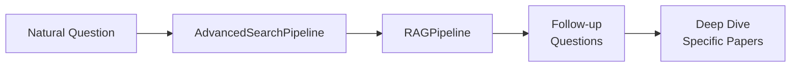
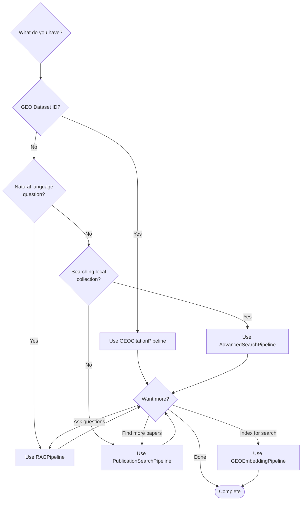
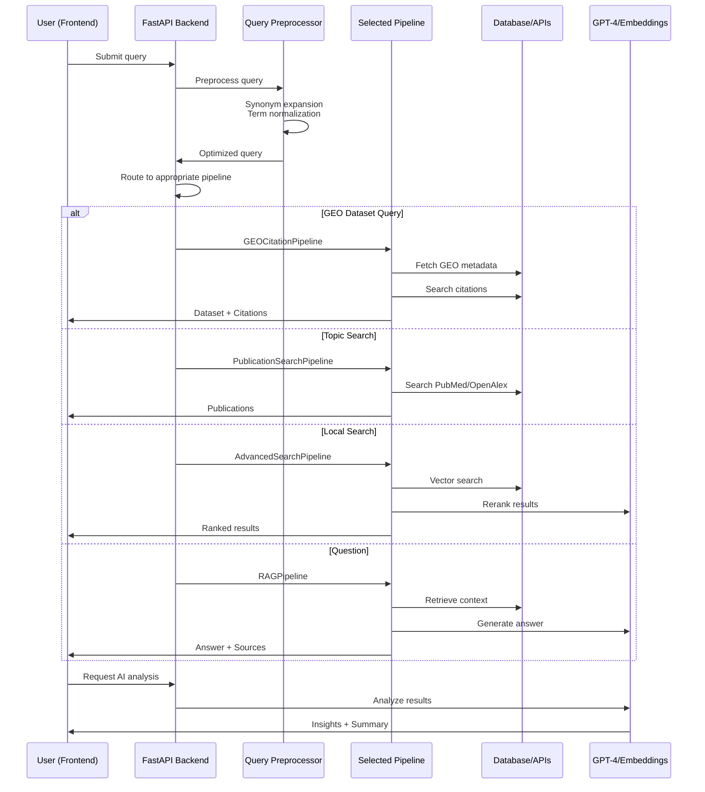

# OmicsOracle Pipeline Flow: End-to-End Query Processing

**Visual guide showing how pipelines interact from user query to final results**

---

## 🔍 Complete Query Flow Diagram

```mermaid
flowchart TD
    Start([User enters search query<br/>in frontend]) --> QueryType{What is the<br/>user searching for?}

    %% Branch 1: GEO Dataset Search
    QueryType -->|"GEO Dataset ID<br/>(e.g., GSE123456)"| GEOPath[GEO Dataset Workflow]
    GEOPath --> GEOClient[GEO Client<br/>Fetch dataset metadata]
    GEOClient --> HasPMID{Dataset has<br/>PubMed ID?}

    HasPMID -->|Yes| GeoCitPipeline[GEOCitationPipeline<br/>Find citing papers]
    HasPMID -->|No| GeoEmbed[GEOEmbeddingPipeline<br/>Generate embeddings]

    GeoCitPipeline --> CitationResults[Citation Results:<br/>- Citing publications<br/>- PDF URLs<br/>- Metadata]
    GeoEmbed --> EmbedResults[Embeddings stored<br/>for semantic search]

    CitationResults --> DisplayGEO[Display to Frontend:<br/>- Dataset info<br/>- Citations<br/>- Download PDFs]
    EmbedResults --> DisplayGEO

    %% Branch 2: Topic/Keyword Search
    QueryType -->|"Topic or Keywords<br/>(e.g., 'breast cancer RNA-seq')"| TopicPath[Topic Search Workflow]
    TopicPath --> QueryPreprocess[Query Preprocessing:<br/>- Synonym expansion<br/>- Genomic term normalization<br/>- Boolean optimization]

    QueryPreprocess --> SearchDecision{Where to<br/>search?}

    SearchDecision -->|"External databases<br/>(NEW papers)"| PubSearch[PublicationSearchPipeline<br/>Search: PubMed, OpenAlex, Scholar]
    SearchDecision -->|"Local indexed data<br/>(YOUR collection)"| AdvSearch[AdvancedSearchPipeline<br/>Semantic search over embeddings]

    PubSearch --> PubResults[Publication Results:<br/>- Papers from APIs<br/>- Metadata<br/>- Citations]
    AdvSearch --> AdvResults[Advanced Results:<br/>- Relevant documents<br/>- Similarity scores<br/>- Context snippets]

    PubResults --> EnrichDecision{Enrich with<br/>full text?}
    AdvResults --> DisplayTopic[Display to Frontend:<br/>- Search results<br/>- Relevance ranking<br/>- Export options]

    EnrichDecision -->|Yes| PDFPipeline[PDF Download +<br/>PDFTextExtractor<br/>Extract full text]
    EnrichDecision -->|No| DisplayTopic

    PDFPipeline --> EmbedNew{Index for<br/>future search?}
    EmbedNew -->|Yes| GeoEmbed2[GEOEmbeddingPipeline<br/>Generate embeddings]
    EmbedNew -->|No| DisplayTopic

    GeoEmbed2 --> VectorStore[(Vector Database<br/>FAISS)]
    VectorStore --> DisplayTopic

    %% Branch 3: Question Answering
    QueryType -->|"Natural language question<br/>(e.g., 'What is ATAC-seq?')"| QAPath[Q&A Workflow]
    QAPath --> ContextDecision{Do we have<br/>documents?}

    ContextDecision -->|Yes, use existing| RAGPipeline[RAGPipeline<br/>Question answering over docs]
    ContextDecision -->|No, search first| SearchFirst[AdvancedSearchPipeline<br/>Find relevant docs]

    SearchFirst --> RAGPipeline
    RAGPipeline --> RAGResults[AI-Generated Answer:<br/>- Direct answer<br/>- Source citations<br/>- Confidence score]
    RAGResults --> DisplayQA[Display to Frontend:<br/>- Answer<br/>- Sources<br/>- Related questions]

    %% User actions after results
    DisplayGEO --> UserAction{User action?}
    DisplayTopic --> UserAction
    DisplayQA --> UserAction

    UserAction -->|"Analyze with AI"| AIAnalysis[GPT-4 Analysis<br/>Insights & Summary]
    UserAction -->|"Export results"| Export[Export to:<br/>JSON, CSV, PDF]
    UserAction -->|"Refine search"| QueryType
    UserAction -->|"Ask question<br/>about results"| QAPath
    UserAction -->|"Done"| End([End])

    AIAnalysis --> DisplayGEO
    Export --> End

    %% Styling
    classDef pipelineClass fill:#4A90E2,stroke:#2E5C8A,stroke-width:2px,color:#fff
    classDef decisionClass fill:#F5A623,stroke:#C17D11,stroke-width:2px,color:#fff
    classDef resultClass fill:#7ED321,stroke:#5FA019,stroke-width:2px,color:#fff
    classDef displayClass fill:#BD10E0,stroke:#8B0AA8,stroke-width:2px,color:#fff
    classDef storageClass fill:#50E3C2,stroke:#3AAA91,stroke-width:2px,color:#000

    class GeoCitPipeline,PubSearch,AdvSearch,RAGPipeline,GeoEmbed,GeoEmbed2,PDFPipeline pipelineClass
    class QueryType,HasPMID,SearchDecision,EnrichDecision,EmbedNew,ContextDecision,UserAction decisionClass
    class CitationResults,PubResults,AdvResults,RAGResults,EmbedResults resultClass
    class DisplayGEO,DisplayTopic,DisplayQA,AIAnalysis displayClass
    class VectorStore storageClass
```



---

## 📊 Pipeline Usage Breakdown

### 1. **GEOCitationPipeline** (Blue)
**When:** User has a specific GEO dataset ID
**Flow:** GEO ID → Metadata → Citations → PDFs
**Output:** Dataset info + citing publications
**Example:** "Show me papers citing GSE123456"

```
User Query: "GSE123456"
    ↓
GEO Client (fetch metadata)
    ↓
GEOCitationPipeline (find citations)
    ↓
Results: Dataset + 50 citing papers
```

---

### 2. **PublicationSearchPipeline** (Blue)
**When:** User searches for publications on a topic
**Flow:** Query → API Search → Results → Optional PDF download
**Output:** Publications from PubMed/OpenAlex/Scholar
**Example:** "Find papers about CRISPR gene editing"

```
User Query: "CRISPR gene editing"
    ↓
Query Preprocessing (synonyms, optimization)
    ↓
PublicationSearchPipeline
    ├─ PubMed API
    ├─ OpenAlex API
    └─ Google Scholar
    ↓
Results: 100 relevant papers
```

---

### 3. **AdvancedSearchPipeline** (Blue)
**When:** User searches their local indexed collection
**Flow:** Query → Semantic Search → Ranked Results
**Output:** Documents from user's vector database
**Example:** "Search my collection for RNA-seq protocols"

```
User Query: "RNA-seq protocols"
    ↓
Query Preprocessing
    ↓
AdvancedSearchPipeline
    ├─ Generate query embedding
    ├─ Search vector database
    └─ Rerank with cross-encoder
    ↓
Results: Top 10 relevant docs from YOUR collection
```

---

### 4. **RAGPipeline** (Blue)
**When:** User asks a natural language question
**Flow:** Question → Context Retrieval → GPT-4 → Answer
**Output:** AI-generated answer with sources
**Example:** "What is ATAC-seq used for?"

```
User Query: "What is ATAC-seq used for?"
    ↓
AdvancedSearchPipeline (find relevant docs)
    ↓
RAGPipeline
    ├─ Context: 5 relevant papers
    ├─ GPT-4 processing
    └─ Generate answer
    ↓
Results: Answer + citations + confidence
```

---

### 5. **GEOEmbeddingPipeline** (Blue)
**When:** Indexing new content for semantic search
**Flow:** Documents → Embeddings → Vector Storage
**Output:** Documents ready for semantic search
**Example:** "Index these 100 GEO datasets"

```
New Content: GEO datasets or PDFs
    ↓
GEOEmbeddingPipeline
    ├─ Generate embeddings
    ├─ Chunk long documents
    └─ Store in FAISS
    ↓
Result: Content indexed and searchable
```

---

## 🔄 Common User Workflows

### Workflow 1: GEO Dataset Deep Dive


**Steps:**
1. User enters: `GSE123456`
2. **GEOCitationPipeline** finds 50 citing papers
3. User downloads PDFs
4. **RAGPipeline** answers: "What methods were used?"
5. **GPT-4** provides comprehensive analysis

---

### Workflow 2: Literature Review


**Steps:**
1. User searches: `"breast cancer biomarkers"`
2. **PublicationSearchPipeline** finds 200 papers
3. **GEOEmbeddingPipeline** indexes them
4. **AdvancedSearchPipeline** enables semantic queries
5. Export curated list

---

### Workflow 3: Question-Driven Research


**Steps:**
1. User asks: `"What are current ATAC-seq protocols?"`
2. **AdvancedSearchPipeline** finds relevant papers
3. **RAGPipeline** generates comprehensive answer
4. User asks follow-up questions
5. Deep dive into specific papers

---

## 🎯 Decision Tree: Which Pipeline to Use?



---

## 💡 Pipeline Interaction Examples

### Example 1: Complete Research Flow
**User Goal:** Understand DNA methylation in breast cancer

```
Step 1: Search publications
└─ PublicationSearchPipeline: "DNA methylation breast cancer"
   └─ Results: 150 papers

Step 2: Index the collection
└─ GEOEmbeddingPipeline: Generate embeddings for 150 papers
   └─ Stored in vector database

Step 3: Ask specific questions
└─ RAGPipeline: "What are the main findings?"
   ├─ AdvancedSearchPipeline: Find relevant context
   └─ GPT-4: Generate answer with citations

Step 4: Find related GEO datasets
└─ AdvancedSearchPipeline: "datasets with DNA methylation"
   └─ Results: Links to relevant GEO datasets

Step 5: Explore specific dataset
└─ GEOCitationPipeline: GSE12345
   └─ Find all papers citing this dataset
```

---

### Example 2: Dataset-Centric Research
**User Goal:** Explore a specific GEO dataset comprehensively

```
Step 1: Get dataset info
└─ GEOCitationPipeline: GSE123456
   ├─ Dataset metadata
   └─ 30 citing publications

Step 2: Download and index PDFs
└─ PDF Download + GEOEmbeddingPipeline
   └─ Full-text searchable

Step 3: Find similar datasets
└─ AdvancedSearchPipeline: Search by dataset description
   └─ Similar datasets from collection

Step 4: Comparative analysis
└─ RAGPipeline: "Compare GSE123456 with GSE789012"
   └─ AI-powered comparison with citations
```

---

## 🔧 Technical Flow Details

### Frontend → Backend → Pipeline → Results



---

## 📈 Performance Characteristics

| Pipeline | Speed | API Calls | Caching | Best For |
|----------|-------|-----------|---------|----------|
| **GEOCitationPipeline** | Medium (5-10s) | High (GEO + PubMed) | ✅ Effective | Known GEO IDs |
| **PublicationSearchPipeline** | Medium (3-8s) | Very High (3 APIs) | ✅ Effective | New paper discovery |
| **AdvancedSearchPipeline** | Fast (0.5-2s) | None (local) | ✅ Very effective | Local collections |
| **RAGPipeline** | Slow (10-30s) | Medium (GPT-4) | ⚠️ Limited | Complex questions |
| **GEOEmbeddingPipeline** | Slow (1-5 min) | High (OpenAI) | ✅ Results cached | Batch indexing |

---

## 🎓 Best Practices

### 1. **Start Broad, Refine Narrow**
```
PublicationSearchPipeline (find 200 papers)
    ↓
GEOEmbeddingPipeline (index them)
    ↓
AdvancedSearchPipeline (semantic refinement)
    ↓
RAGPipeline (specific questions)
```

### 2. **Cache Aggressively**
- GEO metadata: 7 days TTL
- Publication searches: 1 day TTL
- Embeddings: Permanent storage
- RAG answers: 12 hours TTL

### 3. **Combine Pipelines**
Don't use pipelines in isolation! Common patterns:
- GEO → Citations → Embeddings → Semantic Search
- Publication Search → Index → Q&A
- Question → Context Search → Answer Generation

---

## 🚀 Quick Reference

**I want to...**

| Goal | Pipeline(s) to Use | Flow |
|------|-------------------|------|
| Find papers about a topic | PublicationSearchPipeline | Query → Search APIs → Results |
| Explore a GEO dataset | GEOCitationPipeline | ID → Metadata → Citations |
| Search my collection | AdvancedSearchPipeline | Query → Vector search → Ranked |
| Answer a question | RAGPipeline + AdvancedSearchPipeline | Q → Context → GPT-4 → A |
| Index new content | GEOEmbeddingPipeline | Docs → Embeddings → Storage |
| Complete workflow | All combined | See workflows above |

---

**See also:**
- [Pipeline Decision Guide](PIPELINE_DECISION_GUIDE.md) - Detailed usage guide
- [API Reference](../API_REFERENCE.md) - API endpoints
- [Examples](../../examples/) - Code examples

**Last Updated:** October 10, 2025
