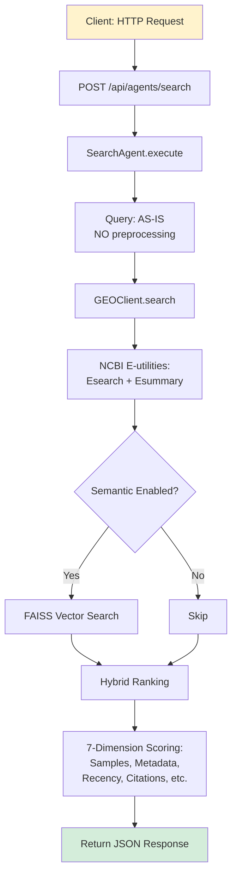
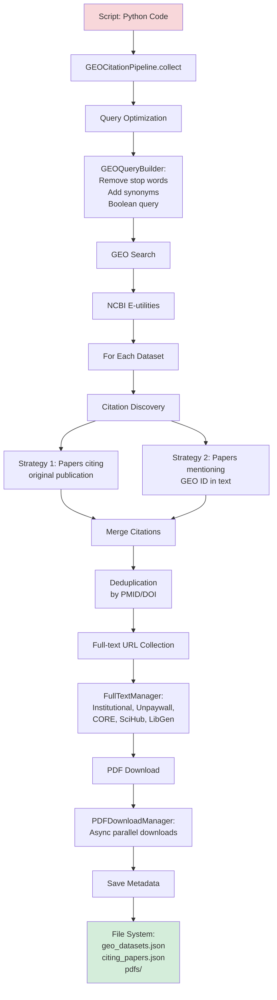

# OmicsOracle: Three Distinct Workflows

**Critical Understanding:** OmicsOracle has **THREE separate workflows**, not one!

---

## 📊 Quick Comparison Table

| Feature | **Workflow 1**<br/>Dashboard Publication Search | **Workflow 2**<br/>GEO API Search | **Workflow 3**<br/>GEO Citation Pipeline |
|---------|------------------------------------------------|-----------------------------------|------------------------------------------|
| **Entry Point** | Streamlit Dashboard | API: `/api/agents/search` | Python Script |
| **Main Pipeline** | `PublicationSearchPipeline` | `SearchAgent` | `GEOCitationPipeline` |
| **Target Data** | Publications (papers) | GEO Datasets | GEO Datasets + Citing Papers |
| **Query Preprocessing** | ✅ YES (NER + Synonyms) | ❌ NO (direct query) | ✅ YES (GEOQueryBuilder) |
| **Sources** | PubMed, OpenAlex, Scholar | NCBI GEO only | NCBI GEO only |
| **Deduplication** | ✅ 2-pass (ID + fuzzy) | ❌ NO | ✅ ID-based |
| **Citation Discovery** | ✅ YES (3 sources) | ❌ NO | ✅ YES (2 strategies) |
| **Full-text URLs** | ✅ 8-source waterfall | ❌ NO | ✅ 5+ source waterfall |
| **PDF Download** | ✅ Optional | ❌ NO | ✅ YES |
| **Text Extraction** | ✅ Optional | ❌ NO | ❌ NO (future) |
| **Ranking** | Multi-factor ML-based | 7-dimension quality | None (save all) |
| **Output** | Streamlit UI display | JSON response | File system (JSON + PDFs) |
| **Use Case** | "Find papers on topic X" | "Search GEO datasets" | "Collect all data on dataset Y" |

---

## 🔄 Visual Flow Comparison

### Workflow 1: Dashboard Publication Search 🌐

```mermaid
graph TD
    A[User: Streamlit Dashboard] --> B[Query: breast cancer BRCA1]
    B --> C{Query Preprocessing}
    C --> D[BiomedicalNER:<br/>Extract entities]
    C --> E[SynonymExpander:<br/>Add synonyms]
    D --> F[Entities: DISEASE=breast cancer<br/>GENE=BRCA1]
    E --> G[Expanded: breast cancer<br/>BRCA1 OR BRCA1 gene]

    F --> H[Build Source Queries]
    G --> H

    H --> I[PubMed Query:<br/>breast cancer[MeSH] AND<br/>BRCA1[Gene Name]]
    H --> J[OpenAlex Query:<br/>Priority: breast cancer BRCA1]
    H --> K[Scholar Query:<br/>breast cancer BRCA1 OR BRCA1 gene]

    I --> L[Search PubMed]
    J --> M[Search OpenAlex]
    K --> N[Search Scholar]

    L --> O[Merge Results]
    M --> O
    N --> O

    O --> P[2-Pass Deduplication]
    P --> Q[Institutional Access Check]
    Q --> R[Full-text URL Collection<br/>8 sources]
    R --> S[Ranking]
    S --> T[Citation Enrichment]
    T --> U[Semantic Scholar Enrichment]
    U --> V{PDF Download?}
    V -->|Yes| W[Download + Extract]
    V -->|No| X[Display in Dashboard]
    W --> X

    style A fill:#e1f5ff
    style X fill:#d4edda
```

### Workflow 2: GEO API Search 🧬



### Workflow 3: GEO Citation Pipeline 📚



---

## 🎯 When to Use Each Workflow

### Use Workflow 1 (Dashboard Publication Search) When:
- ✅ You want to find **papers** on a research topic
- ✅ You need comprehensive search across multiple databases
- ✅ You want citation analysis and impact assessment
- ✅ You need full-text PDFs for reading
- ✅ You want visualizations and analytics
- ✅ You're a researcher exploring a new topic

**Example:** "Find recent papers on CRISPR gene editing in cancer treatment"

---

### Use Workflow 2 (GEO API Search) When:
- ✅ You want to find **GEO datasets** (not papers)
- ✅ You need programmatic API access
- ✅ You want to integrate with external tools
- ✅ You only care about dataset metadata (not citations)
- ✅ Speed is critical (no preprocessing overhead)
- ✅ You're building an automated system

**Example:** "Find GEO datasets with RNA-seq data for breast cancer"

---

### Use Workflow 3 (GEO Citation Pipeline) When:
- ✅ You want to collect **all papers** that used a specific dataset
- ✅ You need bulk PDF downloads for offline analysis
- ✅ You're building a knowledge base from literature
- ✅ You want to track dataset impact and reuse
- ✅ You need data for future LLM analysis
- ✅ You're doing systematic literature review

**Example:** "Collect all papers that used GEO dataset GSE12345 and download their PDFs"

---

## 🔑 Key Architectural Insights

### Why Three Workflows?

1. **Different Data Types:**
   - Workflow 1: Publications (papers from journals)
   - Workflow 2: GEO Datasets (genomic data series)
   - Workflow 3: Publications + Datasets (hybrid)

2. **Different Use Cases:**
   - Workflow 1: Interactive research
   - Workflow 2: Programmatic integration
   - Workflow 3: Batch collection

3. **Different Performance Needs:**
   - Workflow 1: Rich features > speed
   - Workflow 2: Speed > features
   - Workflow 3: Completeness > speed

### Common Components Shared

Despite being separate workflows, they share:
- ✅ **Deduplication logic** (AdvancedDeduplicator)
- ✅ **Full-text collection** (FullTextManager)
- ✅ **PDF download** (PDFDownloadManager)
- ✅ **Citation discovery** (CitationFinder)
- ✅ **Configuration system** (feature toggles)

### Current vs. Planned Integration

**Current State:**
- ❌ Workflows are **completely independent**
- ❌ No data sharing between workflows
- ❌ Results stored in different formats

**Future Enhancement (Phase 7):**
- ⏳ Unified knowledge base across all workflows
- ⏳ Cross-workflow analysis (e.g., "which papers used which datasets?")
- ⏳ Shared document analysis pipeline
- ⏳ Integrated chat interface over all collected data

---

## 💡 Recommendations

### For End Users (Researchers):
**Start with Workflow 1 (Dashboard)**
- Most user-friendly
- Best for exploration
- Rich visualizations
- Comprehensive results

### For Developers (Integration):
**Use Workflow 2 (API)**
- Clean JSON responses
- Fast and lightweight
- Easy to integrate
- Programmatic access

### For Power Users (Bulk Collection):
**Use Workflow 3 (Pipeline)**
- Collect everything at once
- Build local knowledge base
- Prepare for deep analysis
- Offline access to papers

---

## 🚀 Future Vision: Unified System

### Phase 7 Goal: Connect All Workflows

```
┌─────────────────────────────────────────────────────────┐
│                 Unified Knowledge Base                   │
│  ┌────────────┐  ┌────────────┐  ┌────────────┐        │
│  │ Publications│  │ GEO Datasets│  │ Citations  │        │
│  │   (Papers)  │  │  (Series)   │  │  (Links)   │        │
│  └────────────┘  └────────────┘  └────────────┘        │
└─────────────────────────────────────────────────────────┘
                          │
        ┌─────────────────┼─────────────────┐
        │                 │                 │
        ▼                 ▼                 ▼
┌──────────────┐  ┌──────────────┐  ┌──────────────┐
│  Dashboard   │  │   API        │  │  Pipeline    │
│  (Workflow 1)│  │ (Workflow 2) │  │ (Workflow 3) │
└──────────────┘  └──────────────┘  └──────────────┘
        │                 │                 │
        └─────────────────┼─────────────────┘
                          │
                          ▼
              ┌───────────────────────┐
              │  Analysis Pipeline     │
              │  - Document Analysis   │
              │  - RAG Q&A            │
              │  - Insights Generation│
              │  - Research Ideas     │
              └───────────────────────┘
```

### Benefits of Integration:
1. **Cross-workflow queries:** "Show me papers that used datasets I searched for"
2. **Unified analysis:** Analyze all collected documents together
3. **Better insights:** Connect dataset usage to research outcomes
4. **Single knowledge base:** One source of truth for all data

---

## 📝 Conclusion

**Remember:**
- 🌐 **Workflow 1 (Dashboard):** Interactive publication search with advanced features
- 🧬 **Workflow 2 (API):** Fast GEO dataset search for programmatic access
- 📚 **Workflow 3 (Pipeline):** Bulk collection of datasets + citing papers + PDFs

**Current Reality:**
- All three workflows are **fully implemented** and **working**
- They operate **independently** with minimal data sharing
- Each optimized for its specific use case

**Future Direction (Phase 7):**
- Unify workflows under common knowledge base
- Add document analysis and insights generation
- Enable cross-workflow queries and integration
- Build chat interface over all collected data

The key insight: **They're not alternative approaches—they're complementary tools for different scenarios!**
